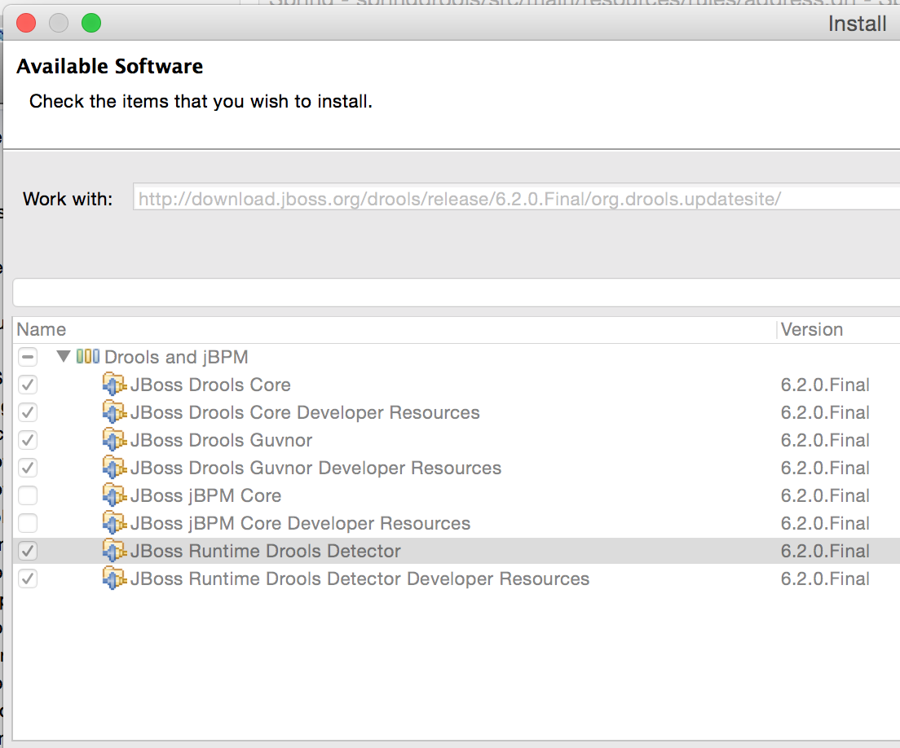

# spring-boot-starter-drools
[](https://travis-ci.org/jonashackt/spring-boot-starter-drools)
[](https://coveralls.io/r/jonashackt/spring-boot-starter-drools)
[](https://jitpack.io/#jonashackt/spring-boot-starter-drools)
[](https://jitpack.io/#jonashackt/spring-boot-starter-drools)

Spring Boot Starter for booting fast with the JBoss Business Rules Engine Drools Expert and KIE Components

### Howto
See the Testclass for how to use the drools-api (it's basicly the KieSession you need to interact with) or have a look at the [springdrools example project](https://github.com/jonashackt/springdrools), to see how to use the starter in your project.

There´s no official maven-repo-release, so you can use [jitpack]

Step 1. Add the JitPack repository to your build file  
```xml
<repository>
    <id>jitpack.io</id>
    <url>https://jitpack.io</url>
</repository>
```
	
Step 2. Add the dependency in the form (change version to actual commit-id you can lookup [here](https://jitpack.io/#jonashackt/spring-boot-starter-drools))
```xml
<dependency>
    <groupId>com.github.User</groupId>
    <artifactId>spring-boot-starter-drools</artifactId>
    <version>225907afae</version>
</dependency>
```

### Improve
* Error handling of Rules-Editing is bad (getting Cast-Exceptions, when Rules aren´t correctly defined - which happens 1000 times while developing...)

### Drools Eclipse/STS tooling
* if you´re using Spring Tool Suite, be shure you have 3.6.4 or higher, otherwise you get an installation error with drools described on [stackoverflow]
* install drools with [droolsupdatesite] for 6.2.0.Final or if the version is old, get the newest from [droolsdownload]:



[jitpack]:https://jitpack.io/
[stackoverflow]:http://stackoverflow.com/questions/28847975/eclipse-missing-requirement-e4-rcp-patch-when-installing-properties-editor
[droolsupdatesite]:http://download.jboss.org/drools/release/6.2.0.Final/org.drools.updatesite/
[droolsdownload]:http://www.drools.org/download/download.html
